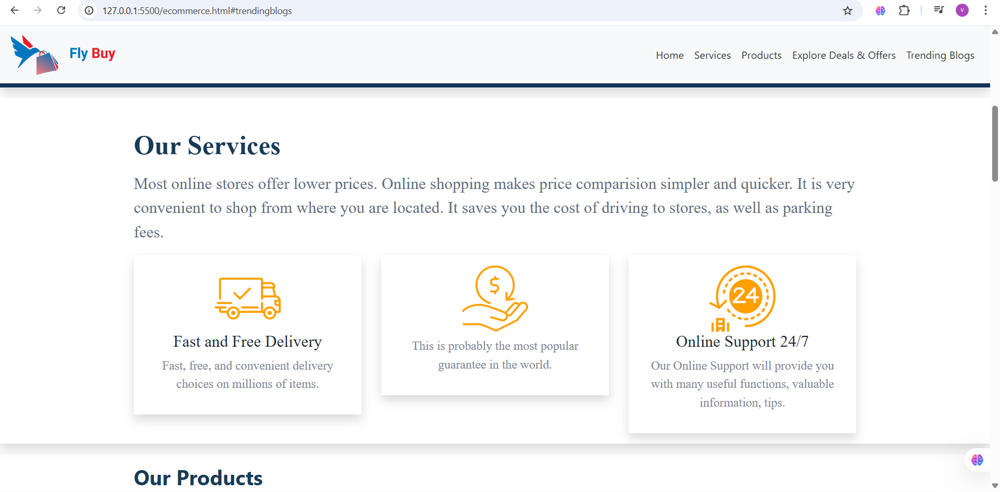
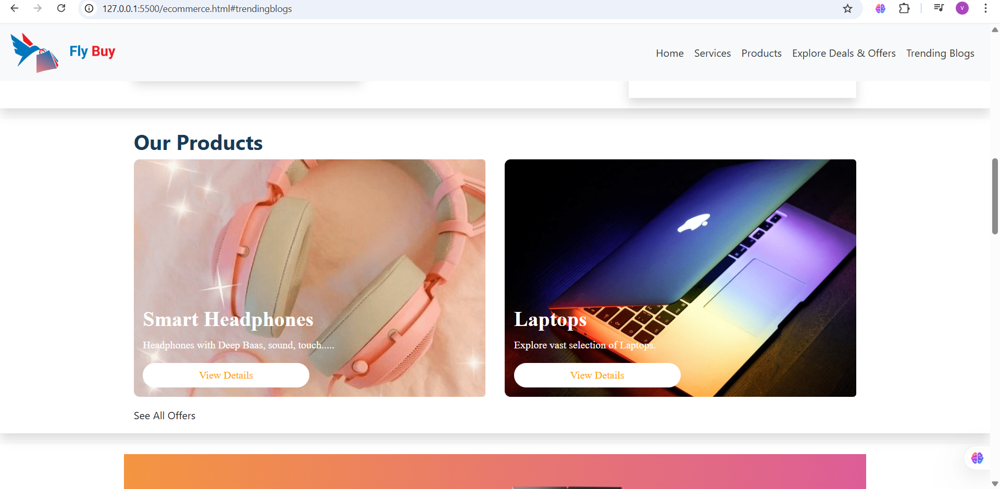
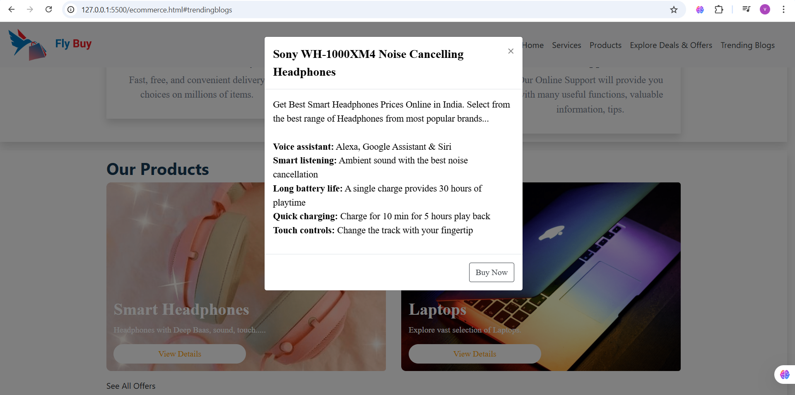
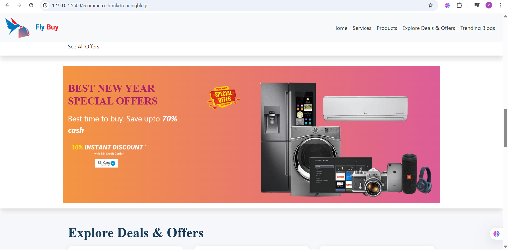
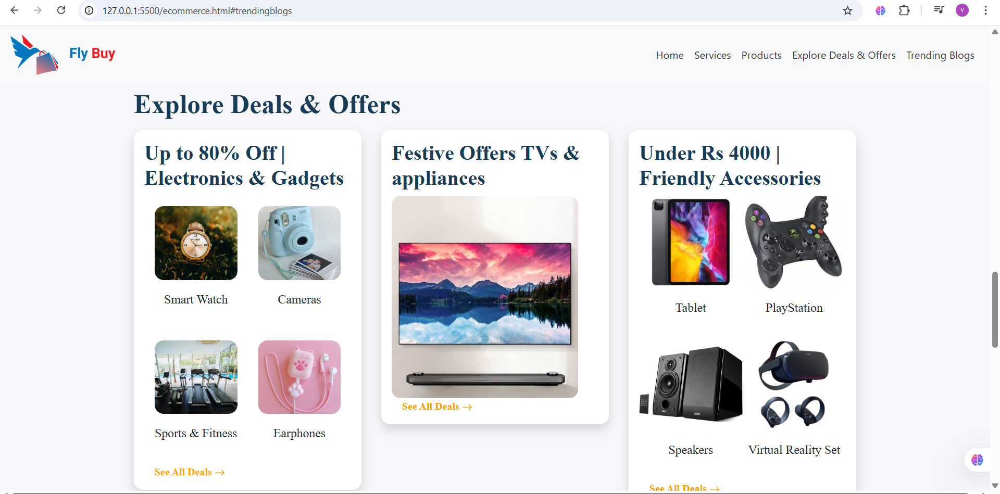
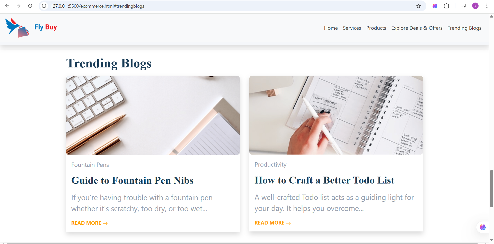
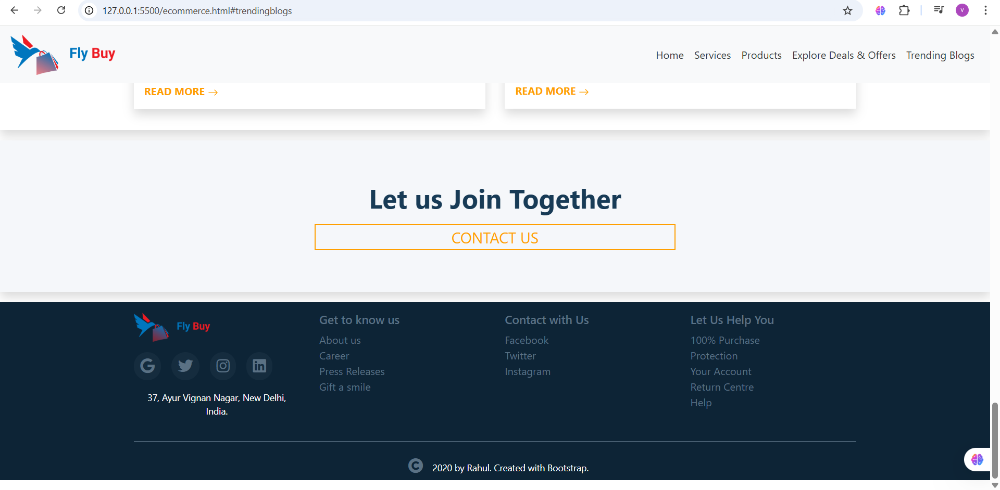

# E-Commerce Website UI
## Overview

A responsive e-commerce website UI built using HTML, CSS, and Bootstrap. The project focuses on clean layout, user-friendly navigation, and structured design.

## Features

- Responsive design (mobile + desktop)
- Navigation bar with smooth layout
- Carousel for product display
- Product cards with modal popups
- Offers and deals section
- Blog section layout
- Footer with social links

## Tech Stack

- HTML5
- CSS3
- Bootstrap 4

## Screenshots

### Homepage

### Services Section

### Products Section

### Product Modal

### offers

# deals

# trending blogs

### Footer

## What I Learned
- Responsive design using Bootstrap  
- UI structuring and layout design  
- Using components like modals and carousels 
